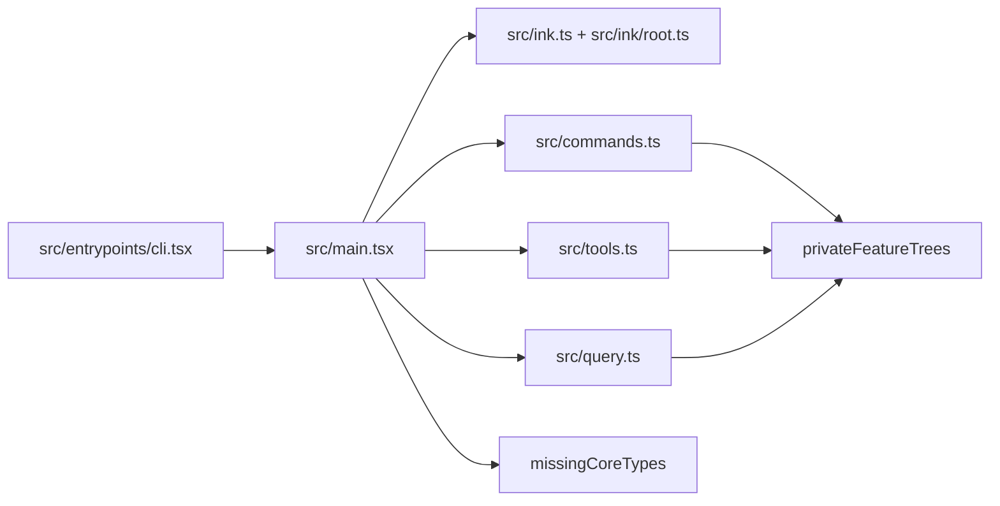

# Claude Code External CLI Reconstruction Plan

Plan is to rebuild an external-safe MVP around the existing Bun CLI entrypoint, not to recreate every Anthropic-private subsystem. The current snapshot has no root build files and still has hundreds of unresolved local imports; the biggest blockers are missing core type modules plus private feature trees, while the terminal renderer itself is already present in-repo.

## Key Evidence

`src/entrypoints/cli.tsx` is the real top-level CLI bootstrap and dynamically loads `src/main.js` for the full application path.

```tsx
// src/entrypoints/cli.tsx
// No special flags detected, load and run the full CLI
const {
  startCapturingEarlyInput
} = await import('../utils/earlyInput.js');
startCapturingEarlyInput();
profileCheckpoint('cli_before_main_import');
const {
  main: cliMain
} = await import('../main.js');
profileCheckpoint('cli_after_main_import');
await cliMain();
```

`src/ink.ts` and `src/ink/root.ts` show the project already vendors its own Ink-compatible renderer wrapper, so `ink` is not the primary runtime dependency.

```tsx
// src/ink.ts
export async function render(
  node: ReactNode,
  options?: NodeJS.WriteStream | RenderOptions,
): Promise<Instance> {
  return inkRender(withTheme(node), options)
}

export async function createRoot(options?: RenderOptions): Promise<Root> {
  const root = await inkCreateRoot(options)
  return {
    ...root,
    render: node => root.render(withTheme(node)),
  }
}
```

`src/main.tsx` relies heavily on Bun feature flags to dead-code-eliminate internal modules at build time.

```tsx
// src/main.tsx
const coordinatorModeModule = feature('COORDINATOR_MODE')
  ? require('./coordinator/coordinatorMode.js') as typeof import('./coordinator/coordinatorMode.js')
  : null;

const assistantModule = feature('KAIROS')
  ? require('./assistant/index.js') as typeof import('./assistant/index.js')
  : null;

const kairosGate = feature('KAIROS')
  ? require('./assistant/gate.js') as typeof import('./assistant/gate.js')
  : null;
```

The import scan found:

- No root `package.json`
- No root `tsconfig.json`
- ~132 external packages referenced
- Hundreds of unresolved local imports
- The highest-fanout missing modules are `src/types/message.ts`, `src/types/tools.ts`, `src/types/utils.ts`, `src/constants/querySource.ts`, `src/keybindings/types.ts`, and `src/entrypoints/sdk/controlTypes.ts`

## Architecture Summary



## Plan

1. Add the project skeleton at the repo root: `package.json`, `tsconfig.json`, and a small Bun build script such as `scripts/build-external.ts`. `tsconfig.json` should use Bun-friendly settings from the docs: `moduleResolution: "bundler"`, `jsx: "react-jsx"`, and `paths: { "src/*": ["./src/*"] }`.

2. Add only the external dependency baseline needed for the real boot path first: `react`, `react-reconciler`, `@commander-js/extra-typings`, `@anthropic-ai/sdk`, `@modelcontextprotocol/sdk`, `chalk`, `lodash-es`, `zod`, `axios`, `figures`, `execa`, `ignore`, `semver`, `strip-ansi`, `yaml`, `ws`, `type-fest`, and other packages that are statically imported by `src/entrypoints/cli.tsx -> src/main.tsx -> src/tools.ts/query.ts`.

3. Add a compile-time compatibility layer for Bun. Use Bun `features` to drive `bun:bundle` dead-code elimination and `define` to inject `MACRO.*` values. Include a global declaration file for `MACRO.VERSION`, `MACRO.BUILD_TIME`, `MACRO.PACKAGE_URL`, `MACRO.VERSION_CHANGELOG`, `MACRO.FEEDBACK_CHANNEL`, and similar constants, plus a `bun:bundle` feature registry so the feature flags are typed.

4. Reconstruct the missing foundational modules before touching higher-level behavior. The first wave should be:
   - `src/types/message.ts`
   - `src/types/tools.ts`
   - `src/types/utils.ts`
   - `src/constants/querySource.ts`
   - `src/keybindings/types.ts`
   - `src/entrypoints/sdk/controlTypes.ts`

5. Fix snapshot-specific compatibility issues in the vendored renderer and transformed files. That likely means adding small shims such as:
   - `src/ink/global.d.ts`
   - `src/ink/events/paste-event.ts`
   - `src/ink/events/resize-event.ts`
   - `src/ink/cursor.ts`
   - `src/ink/devtools.ts`

6. Use feature flags to cut out missing private trees instead of rebuilding them. Keep core CLI, help, and REPL paths on, but force private or clearly unavailable branches off in the external build profile: assistant/Kairos, proactive, server/remote-control extras, workflow scripts, skill-search extras, context-collapse, snip/history, buddy, internal peers/fork/team extras, and anything that depends on `@ant/*` or inaccessible Anthropic packages.

7. Patch the remaining ungated missing imports that feature flags cannot eliminate. The most likely ones are the task unions in `src/tasks/types.ts`, core message/tool typings, and a few dialog/helper paths referenced directly from `src/main.tsx` and `src/dialogLaunchers.tsx`. For this milestone, replacements should preserve type shape and startup behavior, not full product parity.

8. Verify in increasing depth so failures stay localized. First make `bun run src/entrypoints/cli.tsx --version` work. Then make `bun build` of `src/entrypoints/cli.tsx` succeed with the external feature profile. After that, verify `--help`, then boot the interactive app with `--bare` and confirm it reaches a first rendered screen without crashing.

## Verification Target

- `bun install`
- `bun run src/entrypoints/cli.tsx --version`
- `bun build src/entrypoints/cli.tsx --target bun ...`
- `bun run <built-cli> --help`
- `bun run <built-cli> --bare`

## Scope Notes

- Success for this milestone is a working external terminal app shell, not full Claude Code parity.
- Auth, cloud-provider SDK modes, bridge/server workflows, voice, internal analytics, and private Anthropic features should be explicitly disabled or stubbed unless they are required for first render.
- The first code to analyze in depth should be `src/main.tsx`, `src/commands.ts`, `src/tools.ts`, `src/query.ts`, `src/Tool.ts`, and the missing files under `src/types/` and `src/keybindings/`, because that is where the compile fan-out originates.

## Bun Documentation Notes

Based on the current Bun docs:

- Path aliases in `tsconfig.json` are supported and should be used for `src/*`.
- Build-time constants can be injected with `define`.
- `bun:bundle` feature flags can be enabled with `features` or `--feature`, which is the intended mechanism for stripping private code paths from the external build.
